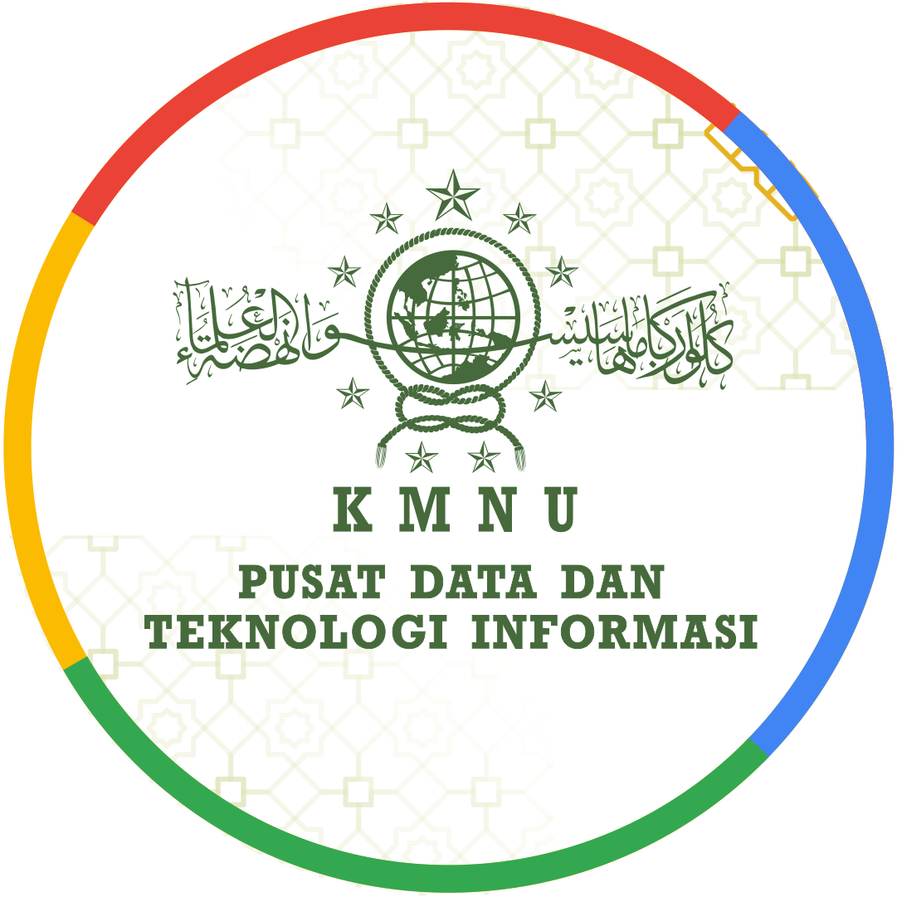

<p align="center">
  <a href="https://kmnu.or.id" target="_blank">
    
    
    
  </a>
</p>

# Hi Tech Enthusiast! 👋
🖥️ The IT Team of KMNU Pusat under the coordination of the National Presidium in the IT Sector provides an opportunity for All KMNU cadres at the 'Perguruan Tinggi' (PT), 'Pengurus Regional' (PR) or Alumni (AL) to contribute together to build <b><a href="www.pusdatin.kmnu.or.id">the Central KMNU Digital Ecosystem</a></b> with various powerful Techstacks. Services from KMNU Pusat:
- 🌐 All KMNU Subdomains with Main Domain <a href="www.kmnu.or.id">```kmnu.or.id```</a>
- 🗄️ Central KMNU Data Information System
- 🔔 URL Shorteners
- 🔮 Mail System, Gallery, Library
- ⚙️ and other digital technology products
<br>
🛠 We also welcome input, suggestions or improvements to the products we have developed. We open <a href="https://github.com/kmnupusat/BugsReport/issues/1#issue-1258411052">pull request<a> if there are suggestions, feedback, or <a href="https://github.com/kmnupusat/BugsReport/issues/1#issue-1258411052">reporting bugs 🦠<a> in our services.

<p>Thank you and let's connect!</p>
<p align="left">  </p> <!-- visitors counted from the date : 9 Augst 2023 -->
